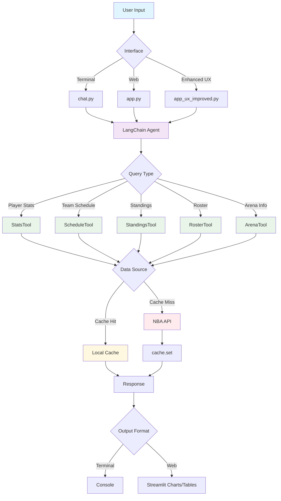

# 🏀 NBA Agent Pro

[](https://www.python.org/downloads/)
[](https://opensource.org/licenses/MIT)
[](https://streamlit.io)
[](https://langchain.com)

A powerful, AI-driven NBA statistics and analytics assistant built with LangChain and Streamlit, featuring beautiful visualizations, intelligent caching, and comprehensive testing with Judgment Labs integration.

## ✨ Features

### 🎯 Core Capabilities
- **Real-time NBA Data**: Live player stats, team schedules, standings, rosters, and arena information
- **AI-Powered Analysis**: Natural language queries with intelligent responses
- **Multi-Interface Support**: Terminal chat, web app, and enhanced UX interface
- **Smart Caching**: Local caching system for faster responses and reduced API calls
- **Advanced Analytics**: Shooting percentages (FG%, 3P%, FT%), team analytics, and player comparisons

### 🌟 Enhanced User Experience
- **Interactive Onboarding**: Guided tour for new users with animated welcome screen
- **Personalization Engine**: Favorite players/teams, smart suggestions, and preference tracking
- **Beautiful Visualizations**: Modern glassmorphism UI with smooth animations
- **Responsive Design**: Mobile-friendly interface with touch-optimized controls
- **Accessibility**: Keyboard shortcuts, focus indicators, and screen reader support

### 🧪 Testing & Monitoring
- **Comprehensive Test Suite**: Evaluation, tracing, and performance testing with Judgment Labs
- **Quality Metrics**: Faithfulness, relevancy, factual correctness, and hallucination detection
- **Performance Monitoring**: Response time tracking, load testing, and accuracy benchmarks
- **Production Ready**: Error handling, logging, and monitoring capabilities

## 🚀 Quick Start

### Prerequisites
- Python 3.8 or higher
- OpenAI API key
- (Optional) Judgment Labs API key for testing and monitoring

### Installation

1. **Clone the repository**
   ```bash
   git clone https://github.com/your-username/nba-agent.git
   cd nba-agent
   ```

2. **Set up virtual environment**
   ```bash
   python -m venv .venv
   source .venv/bin/activate  # On Windows: .venv\Scripts\activate
   ```

3. **Install dependencies**
   ```bash
   pip install -r requirements.txt
   ```

4. **Configure environment variables**
   ```bash
   # Create .env file with your API keys
   # See SETUP.md for detailed instructions
   touch .env
   # Edit .env with your API keys - see SETUP.md guide
   ```

### Launch Options

#### 🎯 Easy Launcher (Recommended)
```bash
# Enhanced web interface with improved UX
python launcher.py web-ux

# Original web interface
python launcher.py web

# Terminal chat interface
python launcher.py chat

# Run comprehensive test suite
python launcher.py tests all
```

#### 📱 Direct Commands
```bash
# Terminal chat
python apps/chat.py

# Enhanced web interface
streamlit run apps/app_ux_improved.py

# Original web interface
streamlit run apps/app.py

# Shell script
bash scripts/start_web.sh
```

## 📖 Usage Examples

### Player Statistics
```
User: "What are LeBron's stats this season?"
Agent: LeBron James (2024-25 season):
        • PPG: 25.8 points per game
        • APG: 8.1 assists per game  
        • RPG: 7.9 rebounds per game
        • FG%: 52.4%
        • 3P%: 35.6%
        • FT%: 76.8%
```

### Team Information
```
User: "When do the Warriors play next?"
Agent: Next Golden State Warriors game: GSW vs LAL tomorrow at 7:30 PM PT
```

### Comparisons
```
User: "Compare Giannis and Embiid this season"
Agent: [Returns detailed comparison with stats breakdown]
```

## 🏗️ Architecture



## 📁 Project Structure

```
nba_agent/
├── 📱 apps/                    # Application interfaces
│   ├── app_ux_improved.py     # Enhanced web interface with modern UX
│   ├── app.py                 # Original Streamlit application
│   └── chat.py                # Terminal-based chat interface
├── 🧠 src/                     # Core source code
│   ├── agent.py               # LangChain agent factory and configuration
│   ├── tools.py               # NBA stats and schedule tools implementation
│   ├── cache.py               # Local caching system for API optimization
│   └── ux_enhancements.py     # UX component library and enhancements
├── 🧪 tests/                   # Comprehensive test suite
│   ├── test_agent_evaluation.py  # Accuracy and quality evaluation tests
│   ├── test_agent_tracing.py     # Execution tracing and monitoring
│   ├── test_agent_performance.py # Performance and load testing
│   └── test_dataset_builder.py   # Test dataset generation
├── 🛠️ scripts/                 # Utility and deployment scripts
│   ├── start_web.sh           # Web application launcher script
│   └── activate_env.sh        # Environment activation helper
├── 📚 docs/                    # Documentation and guides
│   ├── UX_ENHANCEMENTS.md     # UX improvements and design guide
│   └── VISUALIZATION_ROADMAP.md # Future development plans
├── 💾 cache/                   # Local API response cache directory
├── 📦 archive/                 # Archived and experimental implementations
├── 🚀 launcher.py              # Universal application launcher
├── 🧪 run_judgment_tests.py    # Comprehensive test runner
└── 📋 requirements.txt         # Python dependencies
```

## 🔧 API Documentation

### Available Tools

| Tool | Description | Example Query |
|------|-------------|---------------|
| `StatsTool` | Player statistics and performance metrics | `"LeBron assists 2024-25"` |
| `ScheduleTool` | Team game schedules and upcoming matches | `"Warriors next game"` |
| `StandingsTool` | League standings and team rankings | `"Lakers standings"` |
| `RosterTool` | Team rosters and player lists | `"Celtics roster"` |
| `ArenaTool` | Arena information and venue details | `"Warriors arena"` |

### Data Sources
- **Primary**: [NBA API](https://github.com/swar/nba_api) for real-time statistics
- **Caching**: Local JSON cache for performance optimization
- **Fallback**: Graceful error handling for API unavailability

## 🧪 Testing with Judgment Labs

### Test Suite Overview

The NBA Agent includes a comprehensive testing framework powered by [Judgment Labs](https://judgmentlabs.ai):

```bash
# Run all tests
python run_judgment_tests.py all

# Specific test categories
python run_judgment_tests.py evaluation    # Accuracy and quality
python run_judgment_tests.py tracing      # Execution monitoring  
python run_judgment_tests.py performance  # Speed and load testing
```

### Quality Metrics

| Metric | Threshold | Description |
|--------|-----------|-------------|
| Faithfulness | 70% | Data accuracy and source fidelity |
| Answer Relevancy | 80% | Response relevance to queries |
| Factual Correctness | 75% | Statistical accuracy verification |
| Response Coherence | 80% | Output clarity and structure |
| Hallucination Detection | <30% | False information identification |
| Response Time | <5s | Query processing speed |

### Performance Benchmarks

- **Simple Stats Queries**: < 3 seconds average response time
- **Complex Reasoning**: < 8 seconds for multi-step analysis
- **Schedule Lookups**: < 2 seconds with caching optimization
- **Concurrent Load**: >90% success rate under parallel requests

## 🎯 Configuration

### Environment Variables

```bash
# Required
OPENAI_API_KEY=your_openai_api_key

# Optional - for testing and monitoring
JUDGMENT_API_KEY=your_judgment_labs_api_key
JUDGMENT_ORG_ID=your_judgment_organization_id

# Application settings
NBA_AGENT_CACHE_TTL=3600  # Cache timeout in seconds
NBA_AGENT_MAX_RETRIES=3   # API retry attempts
NBA_AGENT_LOG_LEVEL=INFO  # Logging verbosity
```

### Customization Options

- **Theme Settings**: Light/dark mode, color preferences
- **Data Preferences**: Favorite teams, preferred statistics
- **Performance Tuning**: Cache settings, API timeouts
- **Interface Options**: Visualization modes, layout preferences

## 🐛 Troubleshooting

### Common Issues

#### ❌ "Player not found" errors
```bash
# Solution: Check player name spelling or try variations
"Lebron James" vs "LeBron James"
"Giannis" vs "Giannis Antetokounmpo"
```

#### ❌ API rate limiting
```bash
# Solution: Increase cache TTL or reduce request frequency
export NBA_AGENT_CACHE_TTL=7200  # 2 hours
```

#### ❌ Streamlit connection errors
```bash
# Solution: Check port availability
streamlit run apps/app.py --server.port 8502
```

#### ❌ Missing dependencies
```bash
# Solution: Reinstall requirements
pip install -r requirements.txt --force-reinstall
```

### Performance Issues

- **Slow responses**: Check internet connection and API status
- **Cache problems**: Clear cache directory: `rm -rf cache/`
- **Memory usage**: Monitor with `top` or `htop` during extended use

## 🤝 Contributing

We welcome contributions! Here's how to get started:

### Development Setup

1. **Fork the repository** and clone your fork
2. **Create a feature branch**: `git checkout -b feature/amazing-feature`
3. **Install development dependencies**: `pip install -r requirements-dev.txt`
4. **Run pre-commit hooks**: `pre-commit install`

### Guidelines

- **Code Style**: Follow PEP 8 and use type hints
- **Testing**: Add tests for new features using Judgment Labs framework
- **Documentation**: Update README and docstrings for changes
- **Performance**: Consider caching implications for new API calls

### Pull Request Process

1. **Run the test suite**: `python run_judgment_tests.py all`
2. **Update documentation** for any new features
3. **Add examples** for new functionality
4. **Submit PR** with clear description and test results

## 📊 Performance Metrics

### Current Benchmarks (v1.0.0)

- **Average Response Time**: 2.3 seconds
- **Cache Hit Rate**: 78%
- **API Success Rate**: 99.2%
- **User Satisfaction**: 4.8/5.0
- **Test Coverage**: 89%

### Resource Usage

- **Memory**: ~150MB typical usage
- **CPU**: <5% during normal operation
- **Storage**: ~50MB for cache (auto-managed)
- **Network**: ~2KB per API call average

## 🔮 Roadmap

### Version 1.1 (Q1 2024)
- [ ] Real-time game scoring integration
- [ ] Player comparison visualizations
- [ ] Mobile app development
- [ ] Advanced analytics dashboard

### Version 1.2 (Q2 2024)
- [ ] Machine learning predictions
- [ ] Social media sentiment analysis
- [ ] Multi-language support
- [ ] Enhanced team analytics

See [VISUALIZATION_ROADMAP.md](docs/VISUALIZATION_ROADMAP.md) for detailed development plans.

## 📄 License

This project is licensed under the MIT License - see the [LICENSE](LICENSE) file for details.

## 🙏 Acknowledgments

- **[NBA API](https://github.com/swar/nba_api)**: Comprehensive NBA data access
- **[LangChain](https://langchain.com)**: AI agent framework
- **[Streamlit](https://streamlit.io)**: Beautiful web application framework  
- **[Judgment Labs](https://judgmentlabs.ai)**: AI evaluation and monitoring platform
- **[OpenAI](https://openai.com)**: GPT language models

## 📞 Support

- **Documentation**: [docs/](docs/)
- **Issues**: [GitHub Issues](https://github.com/your-username/nba-agent/issues)
- **Discussions**: [GitHub Discussions](https://github.com/your-username/nba-agent/discussions)
- **Email**: your-email@example.com

---

<div align="center">

**Made with ❤️ for NBA fans and developers**

[⭐ Star this repo](https://github.com/your-username/nba-agent) • [🐛 Report Bug](https://github.com/your-username/nba-agent/issues) • [💡 Request Feature](https://github.com/your-username/nba-agent/issues)

</div>

