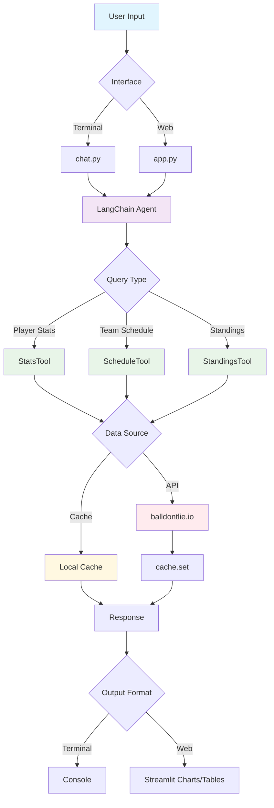

# NBA Agent

A small LangChain-based assistant for checking NBA stats and schedules.

## Features
- **Command-line chat** via `chat.py`.
- **Streamlit web app** using `app.py`.
- Tools for player stats, team schedules, and standings located in `tools.py`.
- **New:** Team roster lookup via the `nba_roster` tool.
- **New:** Team arena lookup via the `nba_arena` tool.
- The stats tool now also exposes shooting percentages (FG%, 3P%, FT%) when available.
- Local caching of API requests under `cache.py`.

## Architecture



## Usage
Run the interactive chat in your terminal:
```bash
python chat.py
```

Launch the web interface:
```bash
bash start_web.sh
```

### Tests
Execute the test suite with:
```bash
python run_judgment_tests.py [all|evaluation|tracing|performance]
```

## Repository Layout
- `agent.py` – agent factory for LangChain
- `chat.py` – terminal chat interface
- `app.py` – Streamlit application
- `tools.py` – stats and schedule tools
- `start_web.sh` – helper script to start the web app

