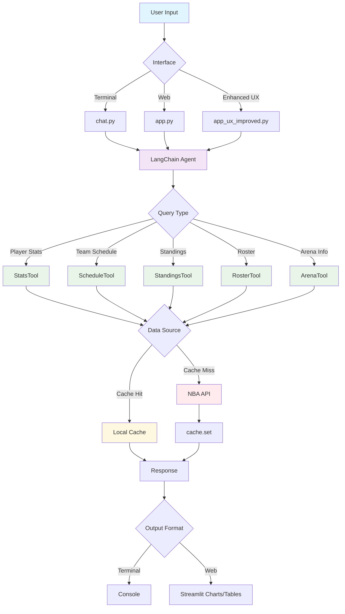

# 🏀 NBA Agent Pro

[](https://www.python.org/downloads/)
[](https://opensource.org/licenses/MIT)
[](https://streamlit.io)
[](https://langchain.com)

A powerful, AI-driven NBA statistics and analytics assistant built with LangChain and Streamlit, featuring beautiful visualizations, intelligent caching, and comprehensive testing with Judgment Labs integration.

## ✨ Features

### 🎯 Core Capabilities
- **Real-time NBA Data**: Live player stats, team schedules, standings, rosters, and arena information
- **AI-Powered Analysis**: Natural language queries with intelligent responses
- **Multi-Interface Support**: Terminal chat, web app, and enhanced UX interface
- **Smart Caching**: Local caching system for faster responses and reduced API calls
- **Advanced Analytics**: Shooting percentages (FG%, 3P%, FT%), team analytics, and player comparisons

### 🌟 Enhanced User Experience
- **Interactive Onboarding**: Guided tour for new users with animated welcome screen
- **Personalization Engine**: Favorite players/teams, smart suggestions, and preference tracking
- **Beautiful Visualizations**: Modern glassmorphism UI with smooth animations
- **Responsive Design**: Mobile-friendly interface with touch-optimized controls
- **Accessibility**: Keyboard shortcuts, focus indicators, and screen reader support

### 🧪 Testing & Monitoring
- **Comprehensive Test Suite**: Evaluation, tracing, and performance testing with Judgment Labs
- **Quality Metrics**: Faithfulness, relevancy, factual correctness, and hallucination detection
- **Performance Monitoring**: Response time tracking, load testing, and accuracy benchmarks
- **Production Ready**: Error handling, logging, and monitoring capabilities

## 🚀 Quick Start

### Prerequisites
- Python 3.8 or higher
- OpenAI API key
- (Optional) Judgment Labs API key for testing and monitoring

### Installation

1. **Clone the repository**
   ```bash
   git clone https://github.com/your-username/nba-agent.git
   cd nba-agent
   ```

2. **Set up virtual environment**
   ```bash
   python -m venv .venv
   source .venv/bin/activate  # On Windows: .venv\Scripts\activate
   ```

3. **Install dependencies**
   ```bash
   pip install -r requirements.txt
   ```

4. **Configure environment variables**
   ```bash
   # Create .env file with your API keys
   # See SETUP.md for detailed instructions
   touch .env
   # Edit .env with your API keys - see SETUP.md guide
   ```

### Launch Options

#### 🎯 Easy Launcher (Recommended)
```bash
# Enhanced web interface with improved UX
python launcher.py web-ux

# Original web interface
python launcher.py web

# Terminal chat interface
python launcher.py chat

# Agentic planning chat
python launcher.py plan

# Run test suite
python launcher.py tests all
```

#### 📱 Direct Commands
```bash
# Terminal chat
python apps/chat.py

Use the planning agent:
```bash
python apps/chat_planner.py
```

Launch the enhanced web interface:
```bash
streamlit run apps/app_ux_improved.py

# Original web interface
streamlit run apps/app.py

# Shell script
bash scripts/start_web.sh
```

## 📖 Usage Examples

### Player Statistics
```
User: "What are LeBron's stats this season?"
Agent: LeBron James (2024-25 season):
        • PPG: 25.8 points per game
        • APG: 8.1 assists per game  
        • RPG: 7.9 rebounds per game
        • FG%: 52.4%
        • 3P%: 35.6%
        • FT%: 76.8%
```

### Team Information
```
User: "When do the Warriors play next?"
Agent: Next Golden State Warriors game: GSW vs LAL tomorrow at 7:30 PM PT
```

### Comparisons
```
User: "Compare Giannis and Embiid this season"
Agent: [Returns detailed comparison with stats breakdown]
```

## 🏗️ Architecture



## 📁 Project Structure

```
nba_agent/
├── src/                    # Core source code
│   ├── agent.py           # LangChain agent factory
│   ├── tools.py           # NBA stats and schedule tools
│   ├── cache.py           # Local caching system
│   └── ux_enhancements.py # UX component library
├── apps/                   # Application interfaces
│   ├── app_ux_improved.py # Enhanced web interface
│   ├── app.py             # Original Streamlit app
│   ├── chat.py            # Terminal chat interface
│   └── chat_planner.py    # Agentic planning chat
├── scripts/               # Utility scripts
│   ├── start_web.sh      # Web app launcher script
│   └── activate_env.sh   # Environment activation
├── docs/                  # Documentation
│   ├── UX_ENHANCEMENTS.md # UX improvements guide
│   └── VISUALIZATION_ROADMAP.md # Future plans
├── tests/                 # Test suite
├── archive/              # Archived/experimental files
├── cache/                # Local API cache
├── launcher.py           # Easy app launcher
└── run_judgment_tests.py # Test runner
```

### Key Files
- **`launcher.py`** - Easy launcher for all interfaces
- **`src/agent.py`** - LangChain agent factory
- **`src/tools.py`** - NBA stats and schedule tools
- **`apps/app_ux_improved.py`** - Enhanced Streamlit interface
- **`apps/chat.py`** - Terminal chat interface
- **`apps/chat_planner.py`** - Planning chat interface
- **`scripts/start_web.sh`** - Shell script to start web app

