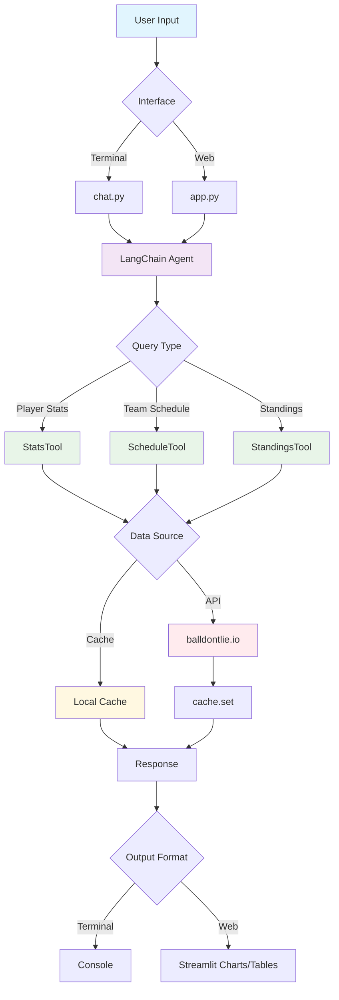

# NBA Agent

A LangChain-based assistant for checking NBA stats and schedules with enhanced user experience.

## Features
- **Enhanced Web Interface** with improved UX, interactive onboarding, and beautiful visualizations
- **Command-line chat** for terminal users
- **Original Streamlit web app** for simpler interface
- Tools for player stats, team schedules, standings, rosters, and arenas
- **Advanced Features:** Shooting percentages (FG%, 3P%, FT%), team analytics, and more
- Local caching of API requests for faster responses
- Comprehensive test suite with Judgment Labs integration
- **Agentic Planning Mode** with conversation memory

## Architecture



## Usage

### Easy Launcher (Recommended)
Use the new launcher script for all interfaces:
```bash
# Enhanced web interface with improved UX
python launcher.py web-ux

# Original web interface
python launcher.py web

# Terminal chat interface
python launcher.py chat

# Agentic planning chat
python launcher.py plan

# Run test suite
python launcher.py tests all
```

### Direct Commands
Run the interactive chat in your terminal:
```bash
python apps/chat.py
```

Use the planning agent:
```bash
python apps/chat_planner.py
```

Launch the enhanced web interface:
```bash
streamlit run apps/app_ux_improved.py
```

Launch the original web interface:
```bash
streamlit run apps/app.py
```

Or use the shell script:
```bash
bash scripts/start_web.sh
```

### Tests
Execute the test suite with:
```bash
python run_judgment_tests.py [all|evaluation|tracing|performance]
```

## Repository Layout

### Core Structure
```
nba_agent/
├── src/                    # Core source code
│   ├── agent.py           # LangChain agent factory
│   ├── tools.py           # NBA stats and schedule tools
│   ├── cache.py           # Local caching system
│   └── ux_enhancements.py # UX component library
├── apps/                   # Application interfaces
│   ├── app_ux_improved.py # Enhanced web interface
│   ├── app.py             # Original Streamlit app
│   ├── chat.py            # Terminal chat interface
│   └── chat_planner.py    # Agentic planning chat
├── scripts/               # Utility scripts
│   ├── start_web.sh      # Web app launcher script
│   └── activate_env.sh   # Environment activation
├── docs/                  # Documentation
│   ├── UX_ENHANCEMENTS.md # UX improvements guide
│   └── VISUALIZATION_ROADMAP.md # Future plans
├── tests/                 # Test suite
├── archive/              # Archived/experimental files
├── cache/                # Local API cache
├── launcher.py           # Easy app launcher
└── run_judgment_tests.py # Test runner
```

### Key Files
- **`launcher.py`** - Easy launcher for all interfaces
- **`src/agent.py`** - LangChain agent factory
- **`src/tools.py`** - NBA stats and schedule tools
- **`apps/app_ux_improved.py`** - Enhanced Streamlit interface
- **`apps/chat.py`** - Terminal chat interface
- **`apps/chat_planner.py`** - Planning chat interface
- **`scripts/start_web.sh`** - Shell script to start web app

